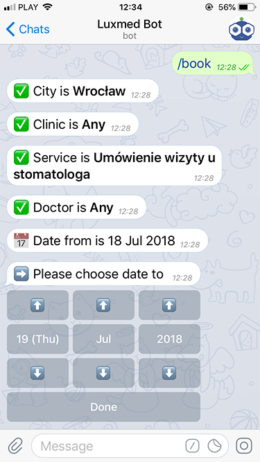

# Luxmed Bot

[](https://drone.rdome.net/dyrkin/luxmed-bot)
[](https://hub.docker.com/r/eugenezadyra/luxmed-bot/tags/)

Unofficial Telegram bot for **Portal Pacjenta LUX MED**.

### Overview 
Luxmed Bot can help you book doctor visits, monitor appointments, and view your upcoming appointments and visit history.

It is available here [@luxmedbot](https://telegram.me/luxmedbot), or you can host your own instance.



### Installation

1. Create a Telegram bot using [@BotFather](https://telegram.me/botfather)
2. Install **Docker** and **Docker Compose**
3. Depending on your platform, download:
    - [docker-compose.yml](https://raw.githubusercontent.com/dyrkin/luxmed-bot/master/docker/docker-compose.yml) 
    - [docker-compose-arm64.yml](https://raw.githubusercontent.com/dyrkin/luxmed-bot/master/docker/docker-compose-arm64.yml)
4. Download [secrets.env.template](https://raw.githubusercontent.com/dyrkin/luxmed-bot/master/docker/secrets.env.template) 
   to the same directory and rename it to **secrets.env**
5. Edit **secrets.env** by specifying your **TELEGRAM_TOKEN** and **SECURITY_SECRET**
6. Start the application by running the following commands:
    ```bash
    docker compose pull
    docker compose up -d
    ```
7. Send the `/start` command to your bot

### Local Development

1. Run `docker compose up -d database` inside the `docker` directory to launch the PostgreSQL database
2. Set the environment variable `TELEGRAM_TOKEN=YOUR_TOKEN`
3. Run the `Boot.scala` application from your IDE (located in the `server` module)
